# Augmentus Assignment

## Core Idea

This project explores two complementary strategies for 3D point cloud segmentation and clustering:

1. **Density-based approach**  
   - Perform *density-preserving sampling* so that dense regions remain dense and sparse regions remain sparse.  
   - Then apply a *density-based clustering* algorithm such as DBSCAN.

2. **Distance-based approach**  
   - Perform *density-equalizing sampling* (e.g., voxel downsampling) so that all regions have roughly uniform point density.  
   - Then apply a *distance-based clustering* algorithm such as Euclidean clustering.

Through experimentation, I found that using approximately **one-third of the original points** achieves the best balance between performance and visual quality.

The primary algorithm used for segmentation is **DBSCAN**, applied on a feature vector that combines:
- 3D position (`x, y, z`)
- Color (`l, a, b`)
- Surface normal (`nx, ny, nz`)

K-Means was tested but proved unsuitable due to its sensitivity to non-spherical clusters.

### Tunable Parameters
- **Epsilon:**  
  Defines the maximum distance between two points for them to be considered neighbors. Smaller values yield finer segmentation; larger values merge nearby clusters.

- **Minimum number of points:**  
  Sets the minimum cluster size. Clusters smaller than this threshold are labeled as noise (`-1`).

- **Feature weights:**  
  Controls the contribution of position, color, and normal vectors in the combined feature space.  
  For example, `(0.6, 0.3, 0.1)` means position contributes 60%, color 30%, and normal 10% to the clustering distance metric.

## Experiment Results

The original Eagle point cloud used for this experiment:

<p align="center">
  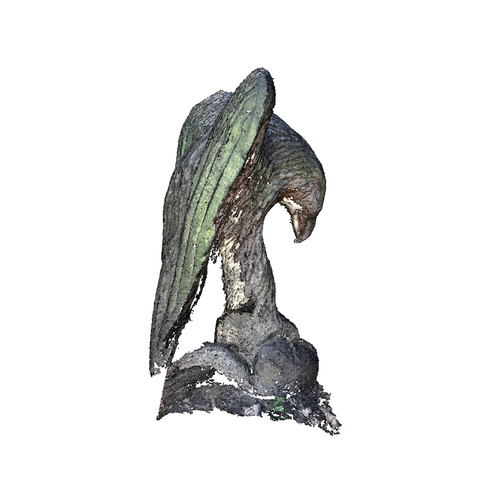
  <br>
  <em>The original point cloud</em>
</p>

**Overview**

A variety of parameter combinations were tested for both density-based and distance-based
approaches. Only a selection of representative and visually meaningful results are shown
below. All generated results can be found in the `output/` directory.

### Density-based Approach

In this approach, uniform downsampling preserves the original density distribution of the
point cloud, allowing DBSCAN to exploit local density variations.

<p align="center">
  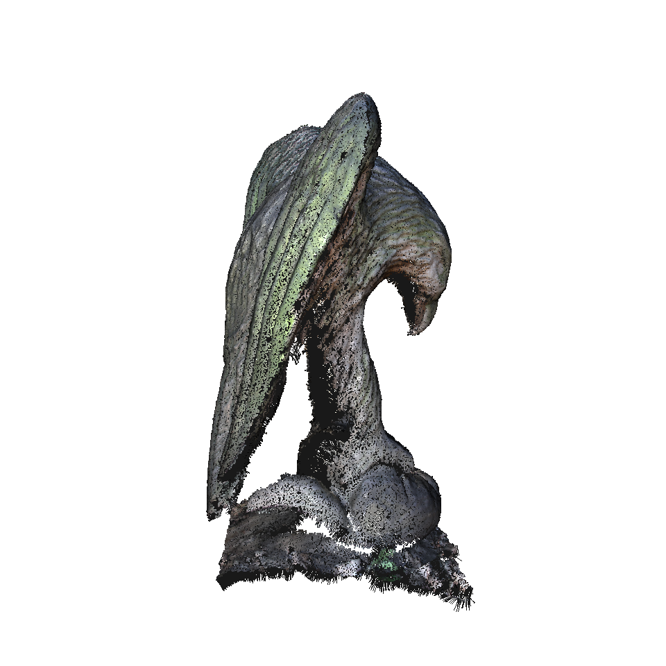
  <br>
  <em>The uniform downsampled point cloud with normals</em>
</p>

Four representative clustering results with visually good segmentations are shown below.

<table>
<tr>
  <td align="center" width="50%">
    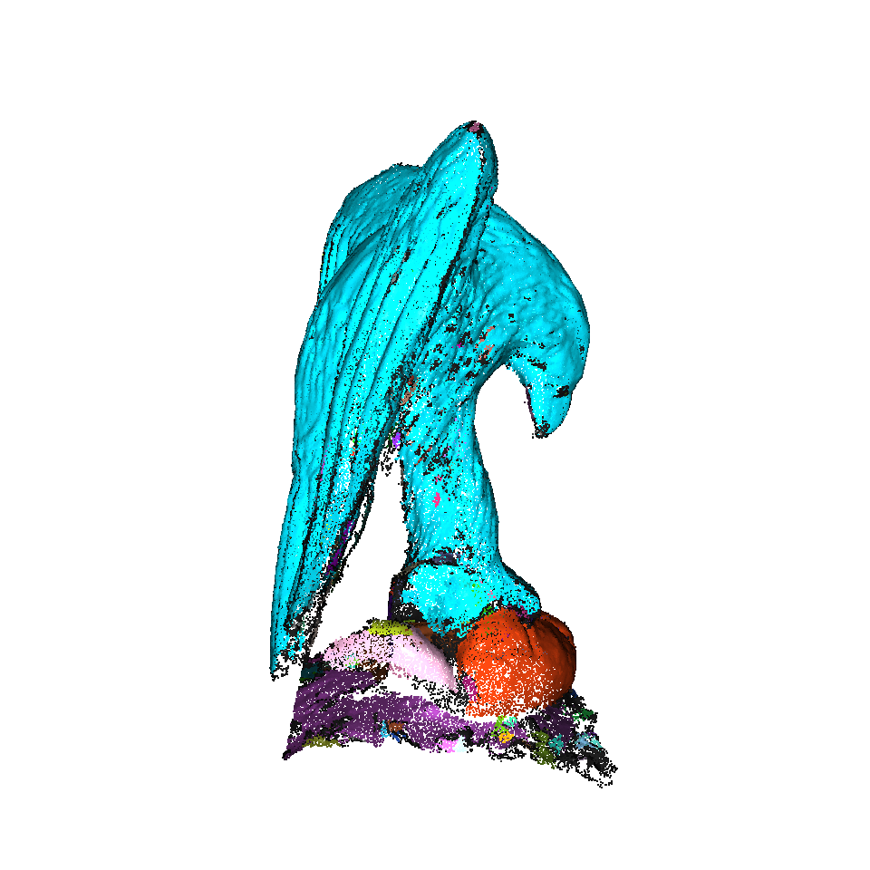<br>
    <em>Top-Left</em>
  </td>
  <td align="center" width="50%">
    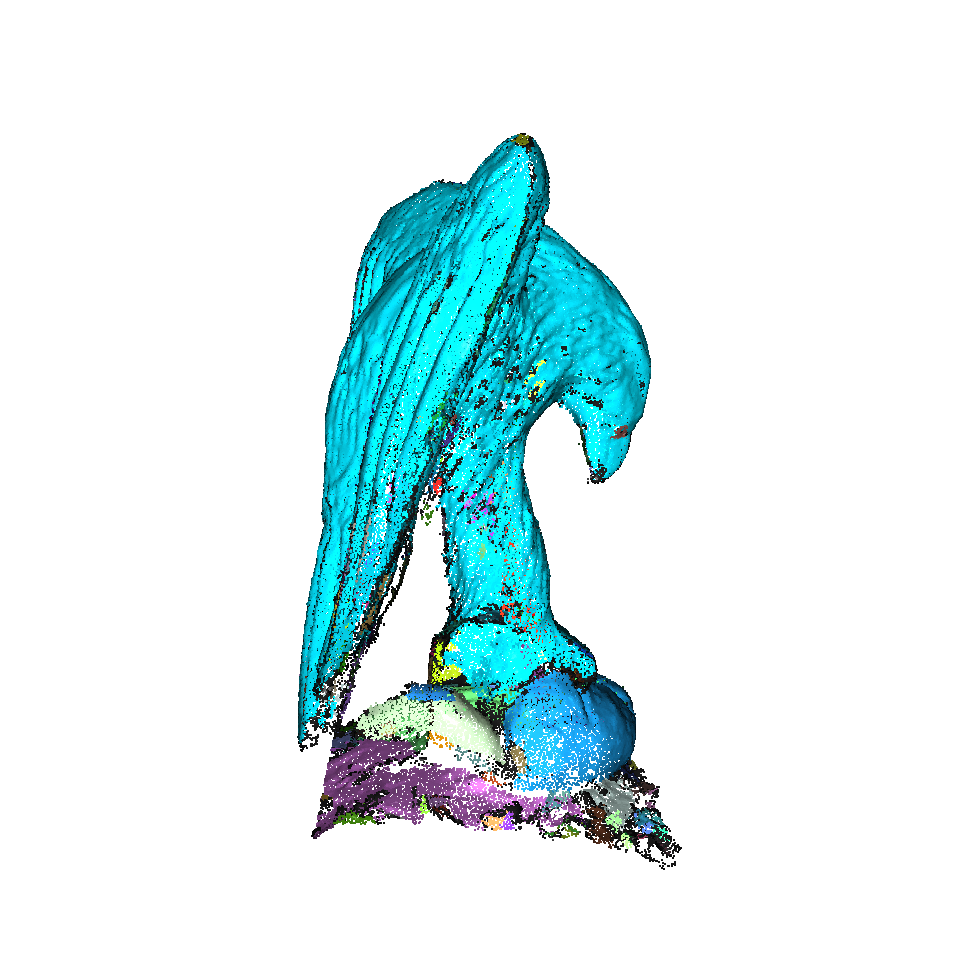<br>
    <em>Top-Right</em>
  </td>
</tr>
<tr>
  <td align="center" width="50%">
    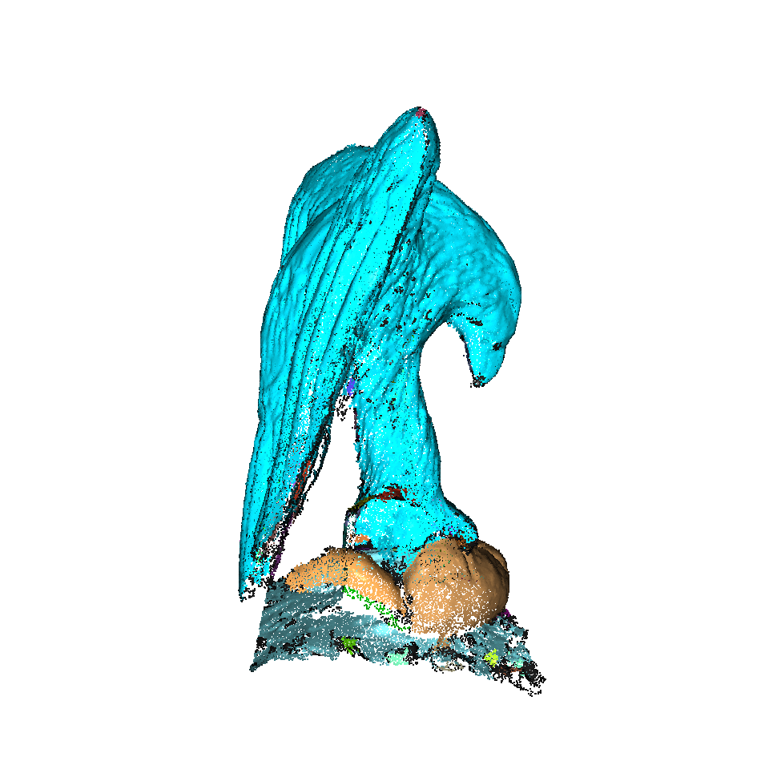<br>
    <em>Bottom-Left</em>
  </td>
  <td align="center" width="50%">
    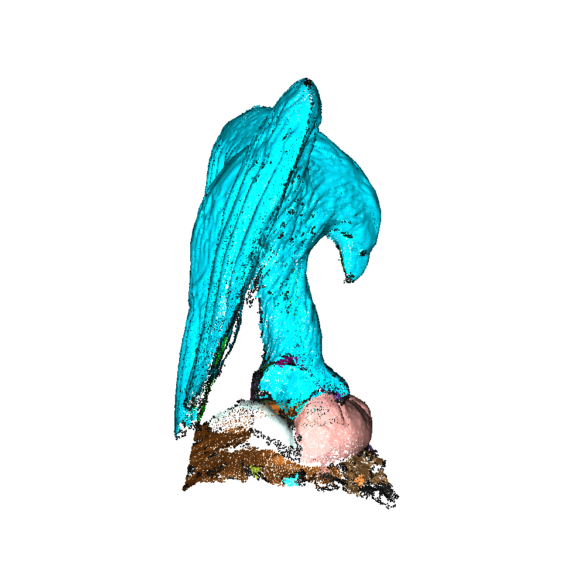<br>
    <em>Bottom-Right</em>
  </td>
</tr>
</table>

<p align="center">
  <em>Uniform downsampled point cloud segmentation results using DBSCAN.</em>
</p>

| Image | every_k_points | epsilon | min_points | Weights (XYZ, Lab, Normal) | #Clusters |
|:------|:--------------|:-------------|:------------|:----------------------------|:-----------:|
| **Top-Left** | 3 | 0.10 | 30 | (0.5, 0.0, 0.5) | 146 |
| **Top-Right** | 3 | 0.10 | 30 | (0.333, 0.333, 0.333) | 229 |
| **Bottom-Left** | 3 | 0.13 | 50 | (0.333, 0.333, 0.333) | 65 |
| **Bottom-Right** | 3 | 0.13 | 50 | (0.5, 0.0, 0.5) | 43 |

### Distance-based Approach

Here, voxel downsampling produces a uniformly distributed point cloud, which is more suitable for Euclidean clustering or distance-based segmentation methods.

<p align="center">
  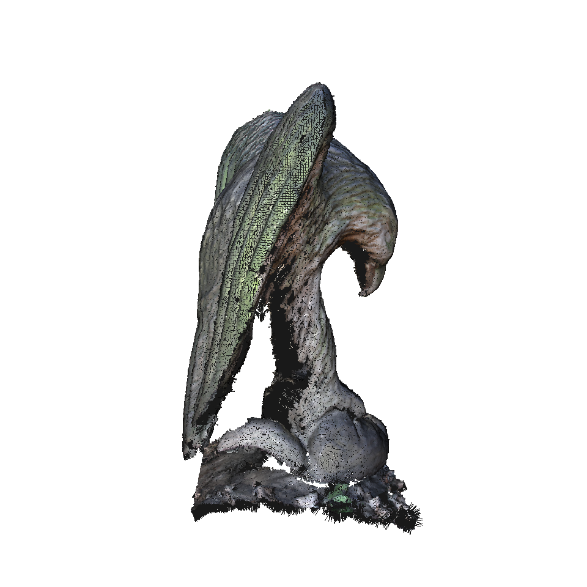
  <br>
  <em>The voxel downsampled point cloud with normals</em>
</p>

Four representative clustering results with visually good segmentations are shown below.

<table>
<tr>
  <td align="center" width="50%">
    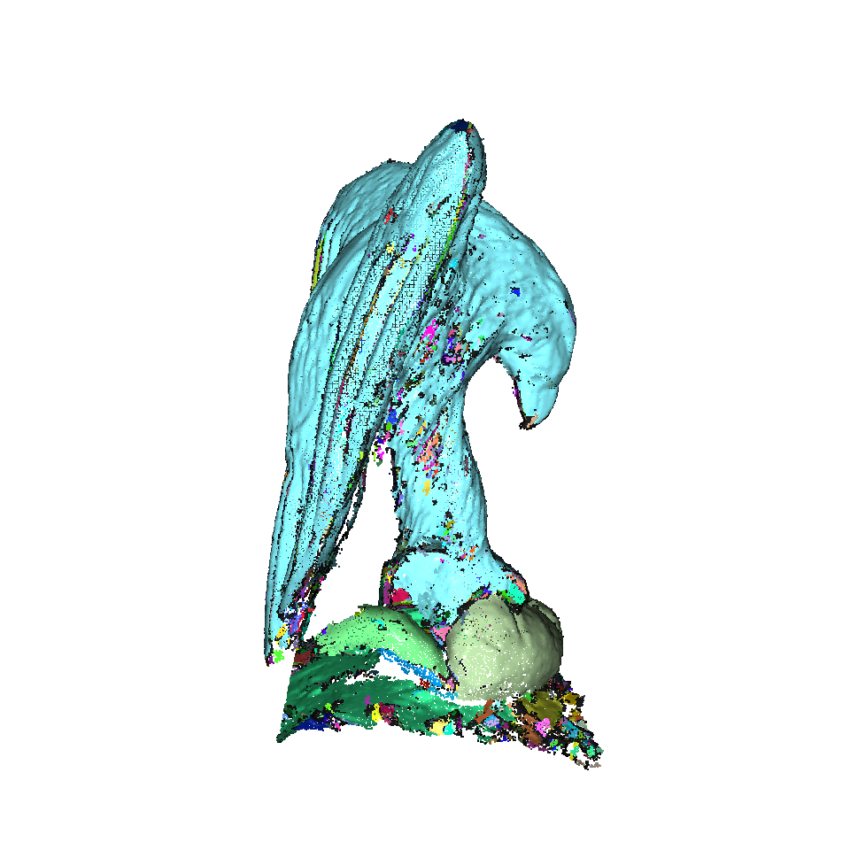<br>
    <em>Top-Left</em>
  </td>
  <td align="center" width="50%">
    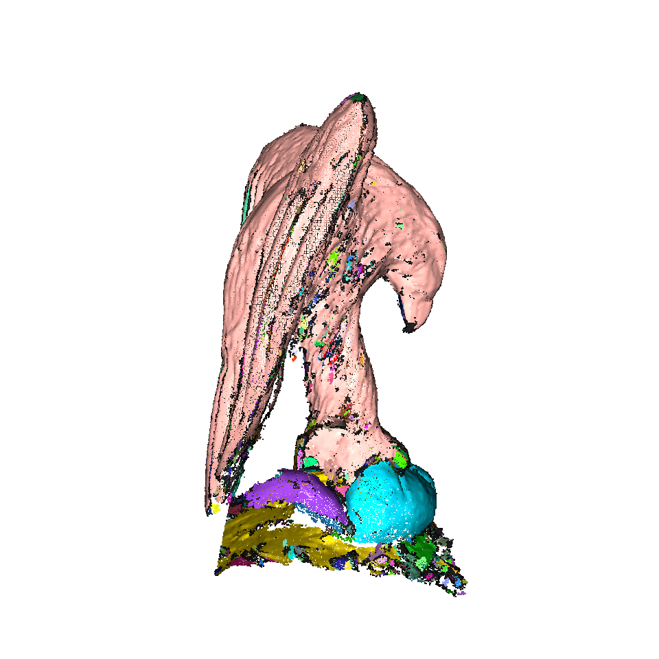<br>
    <em>Top-Right</em>
  </td>
</tr>
<tr>
  <td align="center" width="50%">
    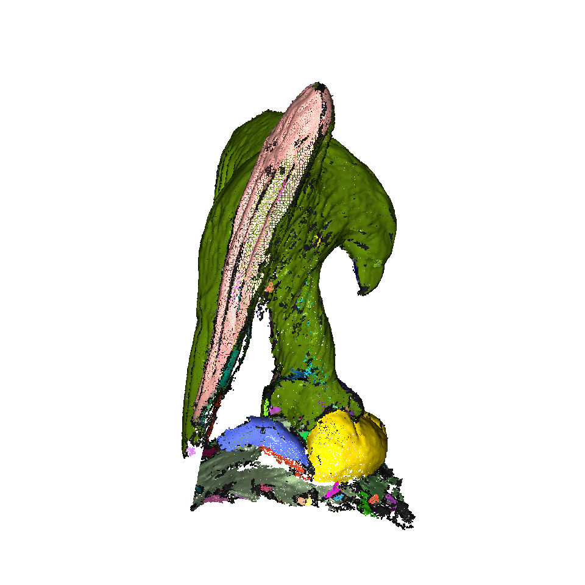<br>
    <em>Bottom-Left</em>
  </td>
  <td align="center" width="50%">
    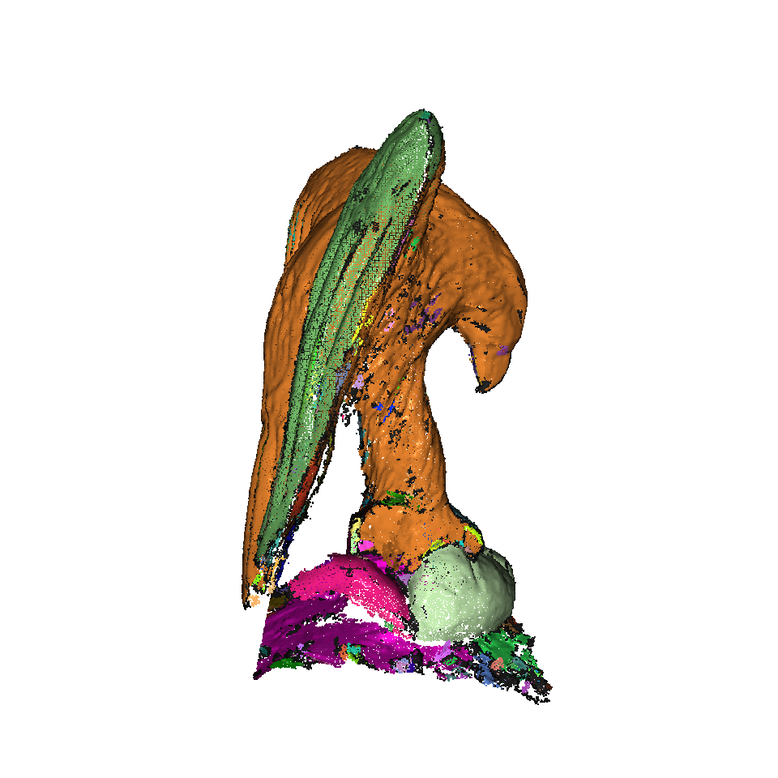<br>
    <em>Bottom-Right</em>
  </td>
</tr>
</table>

<p align="center">
  <em>Voxel downsampled point cloud segmentation results using DBSCAN.</em>
</p>

| Image | voxel_size | epsilon | min_points | Weights (XYZ, Lab, Normal) | #Clusters |
|:------|:--------------|:-------------|:------------|:----------------------------|:-----------:|
| **Top-Left** | 0.023 | 0.07 | 10 | (0.333, 0.333, 0.333) | 1171 |
| **Top-Right** | 0.023 | 0.07 | 10 | (0.5, 0.0, 0.5) | 749 |
| **Bottom-Left** | 0.023 | 0.10 | 30 | (0.5, 0.0, 0.5) | 136 |
| **Bottom-Right** | 0.023 | 0.10 | 30 | (0.333, 0.333, 0.333) | 237 |


## Architecture

This project uses a **src-layout** structure and defines a namespace package `augmentus`.  
The main package `pointcloudprocessor` contains the following modules:

| Module | Purpose |
|---------|----------|
| **cluster** | Implements DBSCAN for point cloud segmentation. |
| **resample** | Provides sampling algorithms. |
| **estimate_normal** | Estimates and orients point cloud normals using local neighborhoods. |
| **render** | Handles offscreen rendering and visualization of point clouds as static images. |
| **process_eagle** | The main entry point that loads the Eagle dataset, runs the full pipeline, and generates results. |


## How to Run

### 1. Install the package
```bash
python3.10 -m venv venv_augmentus
source venv_augmentus/bin/activate
python3 -m pip install .
```
This command install a Python package **pointcloud_processor**.

### 2. Run the main command
```bash
process-eagle -o output
```
This command generates an `output/` folder containing the rendered point cloud segmentation results.

## Development Setup

To install development and testing dependencies:
```bash
python3 -m pip install -e .[dev,test,interactive]
```

Run the provided unit tests with:
```bash
pytest
```

Three unit tests are included to verify core functionality:
1. Point cloud downsampling reduces point count.
2. DBSCAN segmentation detects multiple clusters.
